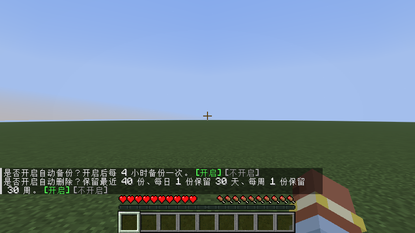

# 0.3.1 / Minecraft 26.3 Fabric 测试记录

日期：2026-10-02。Java 25.0.3、Gradle 9.6.0、Loom 1.17.21、Fabric Loader 0.19.5、Fabric API 0.161.0+26.3、Python 3.14.5、MCDR 2.16.0、官方 Prime Backup 1.13.1。

## 自动化检查

- Python：49 项通过。真实 MCDR 权限、聊天、完整命令图和原生建议；存档独立与配置导入；推荐配置和升级；主玩家 owner、语言；选择持久化；官方 PB 算法的 2,400 份模拟备份；暂停拒绝的即时失败确认；传输、回档、镜像和路径检查。
- Java：8 项通过。鉴权、世界会话与暂停、聊天来源、建议往返、命令图分块原子更新与跨会话拒绝。
- 实际构建：`fabric-bridge/gradlew.bat -p fabric-bridge build --console=plain` 成功。安装用 JAR 逐次归档到独立时间戳目录。

## 真实客户端检查

使用全新的 `.reference/auto-0.3.1-r5` 共用目录和 Fabric 26.3 客户端测试存档，不使用用户的 MCDR 或存档。测试端口随机分配，避开用户正在运行的服务端。

执行 `runClientGameTest` 全部通过，Gradle 报告 `BUILD SUCCESSFUL in 1m 48s`。检查内容：

1. 游戏端启动安装器，从零创建独立环境，联网安装 MCDR/PB 及依赖；主菜单只运行控制器。
2. 进入存档自动获得 owner、PB 默认开启；客户端语言设为 `zh_cn` 后，实际 MCDR 与 PB 消息使用中文。
3. 聊天含自动备份、自动删除两个点击选项。通过 Minecraft 的 `sendUnattendedCommand` 调用点击命令的同一入口，验证两项分别开启、4h 间隔和 `last=40/day=30/week=30`。
4. 独立插件的 `!!extra`、别名 `!!extra_alias`、`nested leaf <value>` 注册到客户端命令树并可执行；MCDR 插件 ID 原生参数补全正常。
5. 卸载插件后移除根命令，再加载后重新注册；改变子指令并重载后，新子指令出现，旧子指令移除。
6. 官方 PB 实际备份；把钻石块改为金块、标记文件改为 `after`，确认 PB 任务结束后回档。保存退出、释放锁、回档及安全备份后，控制器等待 PB 完成再退出。
7. 重新进入自动连接，检查钻石块与标记文件；切换第二个世界，确认选择与数据库独立。导入配置后绑定指向第二个世界，数据库仍为空。
8. 原有导出 ZIP、暂停拒绝、PB/适配插件热重载、持锁拒绝离线回档、玩家背包恢复及代理断开测试。

Fabric 测试框架控制客户端和服务端 tick 阶段，夹具在受控客户端阶段执行异步保存退出。保存、释放锁、回档、重开和数据检查仍调用真实 Minecraft 与官方 PB。发行模组使用正常客户端任务调度器。

## 证据与范围

- [Python 测试](assets/automatic-0.3.1-python.log)
- [客户端完整日志](assets/automatic-0.3.1-game-test.log)
- [安装日志](assets/automatic-0.3.1-install.log)
- [控制器日志](assets/automatic-0.3.1-controller.log)
- [首次存档与回档](assets/automatic-0.3.1-world-first.log)
- [第二个存档与配置导入](assets/automatic-0.3.1-world-second.log)

4 小时备份与 6 小时清理通过实际 PB 配置加载确认，本次没有等待完整 4/6 小时周期；保留规则调用官方 PB 算法验证。正常下载使用官方源，镜像故障和篡改通过注入测试验证。当前环境已有 Python，没有卸载系统 Python 来实测静默安装分支。

仅验证 26.3 Fabric / MCDR 2.16.0 / PB 1.13.1。上一版本记录见 `0.3.0自动启动测试记录.md`。
