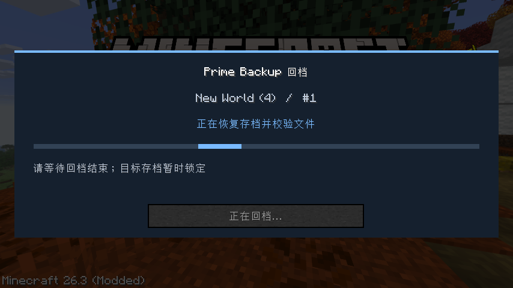
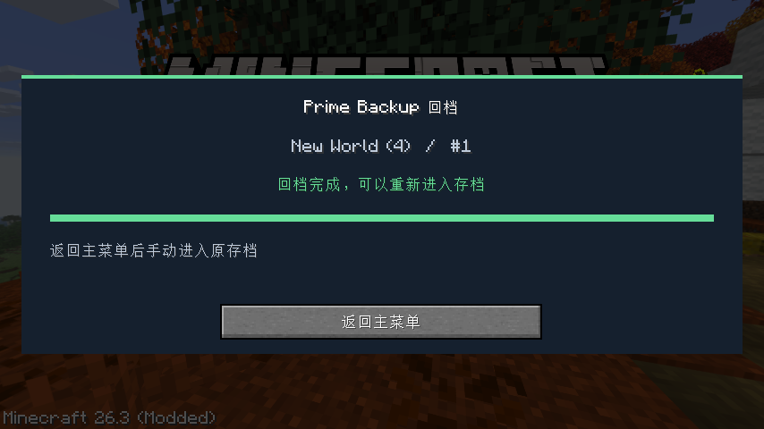

# 0.3.2 / Minecraft 26.3 Fabric 测试记录

日期：2026-10-02。Java 25.0.3、Gradle 9.6.0、Loom 1.17.21、Fabric Loader 0.19.5、Fabric API 0.161.0+26.3、Python 3.14.5、MCDR 2.16.0、官方 Prime Backup 1.13.1。

## 本版行为

回档后在真实主菜单显示目标存档、备份 ID、当前阶段和完成或失败的状态。恢复期间目标存档的打开入口被拦截；完成后解除。文件恢复中途失败或进程中断时，目标存档入口锁保留，成功离线重新回档后才解除。

首次进入世界，左下角分别显示备份总开关、4 小时自动备份、自动删除三个点击选项，选择各自按存档保存。PB 默认开启，自动功能未选择前关闭。

## 自动化检查

- Python：53 项通过。包括真实 MCDR 命令图、权限、建议；推荐配置与备份总开关持久化；独立存档和导入；原子回档状态、取消不能报成功、真实适配钩子的安全备份/恢复阶段和异常；官方 PB 保留算法、暂停拒绝、镜像和路径检查。
- Java：11 项通过。8 项原有桥接测试与 3 项回档状态/入口锁测试。涵盖目标存档锁定、成功解除、无关存档、异常进程退出，以及跨会话、客户端重新创建和未确认重试后仍保留中断恢复的锁。
- 实际构建命令：`fabric-bridge/gradlew.bat -p fabric-bridge build --console=plain` 成功。最新 JAR 归档于 `mod-builds/20261002-114013/mcdr-singleplayer-bridge-0.3.2.jar`；此前构建归档保留。
- 已核对发行 JAR 的版本、Mixin 清单和内嵌安装器：所有 Python 源码与当前项目逐字节一致。

## 真实客户端检查

使用全新的 `.reference/auto-0.3.2-r4` 共用目录与 Fabric 26.3 测试存档，不使用用户的 MCDR 或存档；使用随机测试端口。

执行 `runClientGameTest`，三个测试入口全部通过，Gradle 报告 `BUILD SUCCESSFUL in 2m 12s`：

1. 从零联网安装 MCDR、官方 PB 和依赖，主菜单只运行控制器，进入世界才启动存档环境。
2. 实际主玩家自动获得 owner，中文客户端带动 MCDR/PB 使用中文。聊天中有三个选项及对应的点击命令。
3. 通过 Minecraft `sendUnattendedCommand` 调用同一点击入口，验证备份关闭和重新开启，以及 4h 自动备份、`last=40/day=30/week=30` 清理配置。
4. 插件命令、别名、子指令和参数原生注册与执行；MCDR 插件 ID 参数补全；卸载、重新加载、修改子指令并重载后刷新。
5. 官方 PB 实际备份钻石块与标记文件，再修改为金块与 `after`，确认回档，等待保存退出和回档前安全备份。
6. 在隔离测试插件中暂缓 PB 的文件导出，确认主菜单持续显示“正在恢复存档并校验文件”，原菜单入口隐藏，回档按钮不可用。直接调用原生 `WorldOpenFlows.openWorld` 尝试打开目标存档，实际被 Mixin 拦住；世界仍关闭，标记文件仍为 `after`。
7. 放行恢复后，状态为 completed、入口解除、按钮可点击。实际点击“返回主菜单”，正常菜单恢复，再打开存档检查钻石块和 `before` 标记恢复，MCDR 自动重新连接。
8. 切换第二个世界，备份选择和数据库独立；配置导入重新绑定目标且不复制数据库。
9. 原有真实导出 ZIP、暂停拒绝、PB/适配插件重载、持锁拒绝离线回档、背包恢复及代理连接测试继续通过。

Fabric 测试框架将客户端/服务端分成受控 tick 阶段，并会延后断开世界。测试夹具参照其 `TestSingleplayerContextImpl.close`，等待真实退出结束，再设置标题画面；普通游戏使用 Minecraft 自身的保存退出流程。临时导出等待仅存在于隔离测试插件，30 秒后自动放行，不包含在发行 JAR。保存、备份、校验、入口拦截、完成后的打开和数据验证均使用真实 Minecraft 与官方 PB。

## 证据与范围

- [Python 测试](assets/automatic-0.3.2-python.log)
- [Java 测试](assets/automatic-0.3.2-java.log)
- [客户端完整日志](assets/automatic-0.3.2-game-test.log)
- [安装日志](assets/automatic-0.3.2-install.log)
- [控制器日志](assets/automatic-0.3.2-controller.log)
- [首次存档与回档](assets/automatic-0.3.2-world-first.log)
- [第二存档与导入](assets/automatic-0.3.2-world-second.log)

中断恢复的持久锁通过 Java 测试验证，没有人为终止实际文件恢复来制造损坏。4 小时备份与 6 小时清理通过实际 PB 配置加载确认，没有等待完整周期；保留规则调用官方 PB 算法验证。正常下载使用官方源，镜像故障与篡改通过注入测试覆盖。已有 Python，没有卸载系统 Python 来实测静默安装分支。

仅验证 26.3 Fabric / MCDR 2.16.0 / PB 1.13.1。历史记录见 `0.3.1自动启动测试记录.md` 和 `0.3.0自动启动测试记录.md`。
