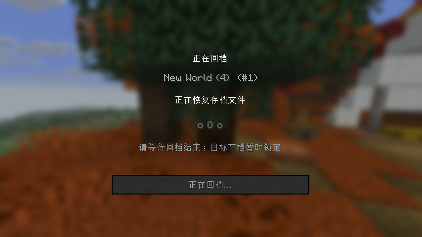
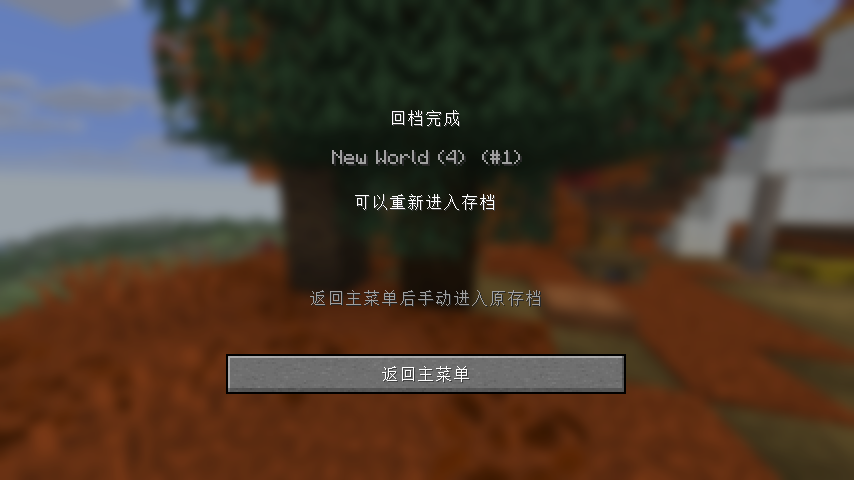

# 0.3.6 Chunk Backup 适配测试记录

测试基线：Minecraft 26.3 Fabric、MCDR 2.16.0、官方 Chunk Backup 2.0.3、官方 candy_tools 1.0.2。

测试日期：2026-10-03，Windows，Java 25、Fabric Loader 0.19.5、Fabric API 0.161.0+26.3。使用隔离测试存档，没有操作玩家实际存档。

## 输出问题与修复

直接执行官方 CB 的原始 `ServerDataGetter.get_position_data()`，在英文环境能获取位置；中文客户端的 `data get entity` 输出为 `Player0拥有以下实体数据：...`，上游固定英文正则匹配失败，原始查询返回 `None`。本次没有证据表明所有 26.3 英文环境都会失败。实际玩家实例的 `logs/debug.log` 不存在；检查了 `latest.log` 和现有控制器日志，没有找到足以还原该次失败的玩家位置反馈，因此用真实客户端测试补充复现。

适配器将 `make` 的玩家查询改为桥接内部请求：服务端线程在同一个 tick 读取玩家坐标和维度，通过已鉴权连接返回 JSON，CB 继续使用原有选区算法。查询不依赖 NBT 字段输出、客户端语言或显示名称；不使用过期位置作为后备值。

## 自动验证结果

- Python：82 项通过。覆盖真实世界关闭后恢复、失败与自动回滚不假报成功、玩家数据错误不解除入口锁、越界与跨存档拒绝、Windows 目录联接拒绝、备份任务互斥、原子位置查询及非法返回值、配置导入重新绑定和状态文件重试。
- Java：18 项通过，包含回档阶段解析、撤销回档无数字槽位、失败锁与中断后锁的持久化。
- 实际 Gradle `build` 和安装包构建通过；每次实际 JAR 构建归档到独立时间戳的 `mod-builds/`。
- 真实 `runClientGameTest` 最终退出码为 0。启用了基础桥接、Prime Backup 与 Chunk Backup 测试；本轮没有启用自动下载安装全过程测试。

Python 测试有一条来自上游 PB 模块的“没有运行 MCDR 环境”警告。官方 candy_tools 在 Python 3.14 下出现正则字符串转义警告，不影响本轮验证结果。

真实客户端已验证：

1. 英文原始位置查询成功，中文原始查询返回 `None`；使用适配器后中文 `!!cb make 1` 创建有效备份，记录实际玩家坐标。
2. 中文 `!!cb pmake 0 0 15 15 in 0 -s` 和 `!!cb dmake 0 -s` 创建静态备份，备份后恢复自动保存。
3. `!!cb back 1` 进入上游确认阶段后执行 `!!cb abort`，收到取消反馈，世界保持打开，状态为取消。
4. `!!cb back 1 -c` 保存退出、释放锁后恢复区域；在真实区域恢复边界暂停测试任务，确认菜单显示恢复阶段且目标世界不能进入。
5. 代理停止后发出控制器退出请求，MCDR 保持运行直到文件任务结束；完成后解锁并重新进入，测试方块从金块恢复为钻石块。
6. 重启同一 MCDR 存档环境，执行 `!!cb restore -c` 撤销回档；重新进入后方块恢复为回档前金块。
7. 原有 PB 备份和回档的客户端回归测试通过。

复测中发现 Windows 界面读取状态文件时短暂阻止原子替换，可能丢失终态。已加入有上限的短暂重试和回归测试；最终客户端复测没有再出现该状态更新错误。另修正测试的取消时机，等待 CB 真正进入确认阶段后发送取消。





## 复现命令

先设置 `MCDR_BRIDGE_TEST_PYTHON`、`MCDR_BRIDGE_TEST_ROOT`、`MCDR_BRIDGE_TEST_PRIME_BACKUP`、`MCDR_BRIDGE_TEST_CHUNK_BACKUP` 和 `MCDR_BRIDGE_TEST_CANDY_TOOLS`，后三项指向对应官方插件文件。

```powershell
./scripts/build.ps1
./fabric-bridge/gradlew.bat -p fabric-bridge runClientGameTest --console=plain
```

## 待人工确认项

自动测试覆盖主世界区块回档和撤销回档，没有覆盖真实 Carpet 玩家数据 `-d`、自定义维度、子备份组合或其他插件版本。建议在单独测试存档验证：

1. 使用中文客户端，在主世界、下界和末地分别执行 `/!!cb make 1`，确认槽位的维度与选区正确，备份结束后自动保存开启。
2. 创建动态与静态备份，修改选区内外的方块，分别回档，确认仅选区内内容恢复且等待时无法进入目标存档。
3. 分别在确认、倒计时阶段取消，确认世界没有退出；未确认时等待超时，不能显示成功。
4. 开启 PB 与 CB，尝试同时发出备份或回档请求，冲突请求应被拒绝；原任务正常结束后可以重试。
5. 切换两个不同存档、导入配置，确认配置与数据各自隔离；原存档的槽位不会出现在目标存档。
6. 若使用 Carpet 与 `-d`，验证玩家数据恢复与错误提示；若测试恢复失败或中断，确认入口仍锁定，在同一存档环境离线成功回档后才解除。不要删除锁文件绕过失败。
