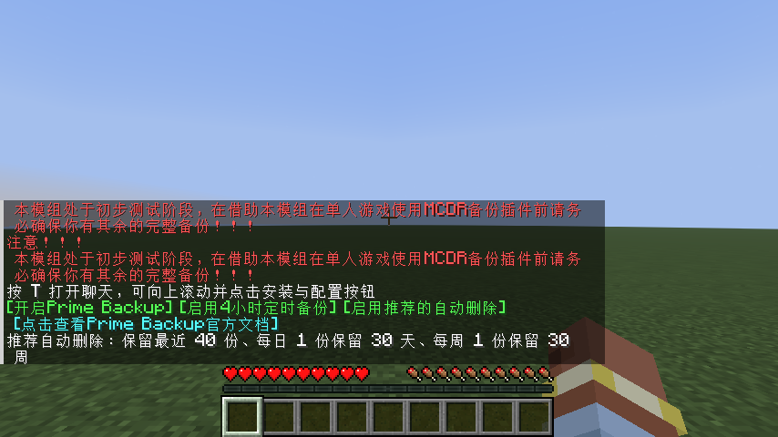
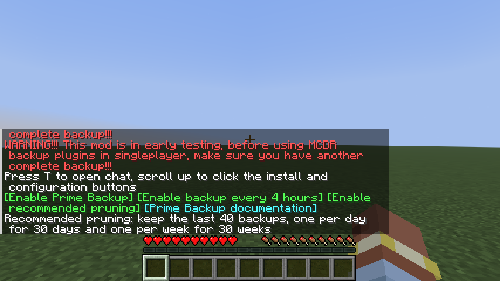

# 0.3.9 语言与图标

基线：Minecraft 26.3、Fabric Loader 0.19.5、Fabric API 0.161.0+26.3、Java 25、MCDR 2.16.0。

## 行为

模组提示移除中文和英文的句末句号，路径、文件扩展名、版本号和指令中的点号保留。首次说明通过换行分隔信息，三次红色备份警告和原有点击操作保留。

本模组的聊天说明、按钮、配置反馈、帮助、回档标题与阶段、失败提示使用语言键。新增英文 `en_us`、繁体中文 `zh_tw`，保留简体中文 `zh_cn`，跟随客户端语言。未提供的语言或翻译键回退英文。上游 MCDR / PB / CB 的文本仍由上游插件自己的语言资源负责。

173 个翻译键集中保存在 `python/singleplayer_bridge/lang/`。构建时同一套 JSON 同时打包到 Python 桥接插件与 JAR 的 `assets/mcdr-singleplayer/lang/`，避免分别维护两份文案。新增翻译时保留键名和 `%s` 参数数量。

图标使用用户提供的原始 128×128 PNG，文件为 `fabric-bridge/src/main/resources/assets/mcdr-singleplayer/icon.png`，由 `fabric.mod.json` 的 `icon` 字段引用。

## 自动化验证

- Python：102 项测试通过，覆盖三种语言的首次说明与配置按钮、三次警告、点击命令、全部翻译键与参数一致性、英文回退、语言路径校验、图标声明与尺寸，以及既有备份和配置流程。
- Java：20 项测试通过，完整构建检查生产代码与资源。
- 真实客户端 `runClientGameTest` 通过：首次安装提示、PB 与 CB 下载加载、定时备份与保留设置、PB 备份与回档、主界面回档进度与存档入口锁、重新进入、切换存档和配置导入。
- 在真实客户端分别切换简体中文、繁体中文、英文，并等待资源重新加载；检查 Minecraft 原生翻译组件、聊天说明、PB 配置按钮和句号移除。
- 修正客户端测试夹具的等待时序：世界创建返回前桥接可能已经就绪，测试改为等待本次世界日志中的就绪标记，避免等待不存在的第二次连接。

三种语言截图来自上述真实客户端流程：

## 人工验收

1. 在 26.3 Fabric 测试实例安装 JAR，在支持展示模组图标的模组列表中确认图标；本轮自动检查了图标文件、尺寸与元数据引用，未运行 Mod Menu 界面。
2. 切换三种语言并进入单人世界，执行 `/!!spbridge onboarding show`，按 T 向上滚动检查说明、警告、安装按钮和配置按钮。
3. 在独立测试存档执行 PB 回档，检查主界面等待、成功、失败提示及存档入口锁；失败时可保留诊断细节，路径和版本号中的点号不应删除。

本轮仅构建与验证 Minecraft 26.3 Fabric。
