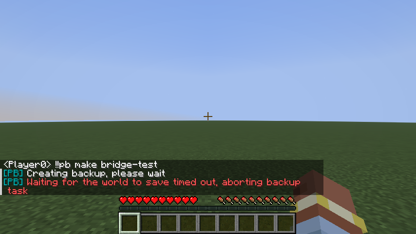
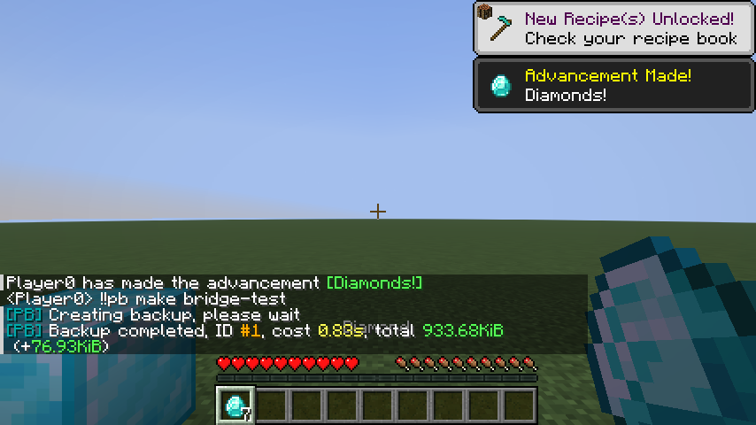
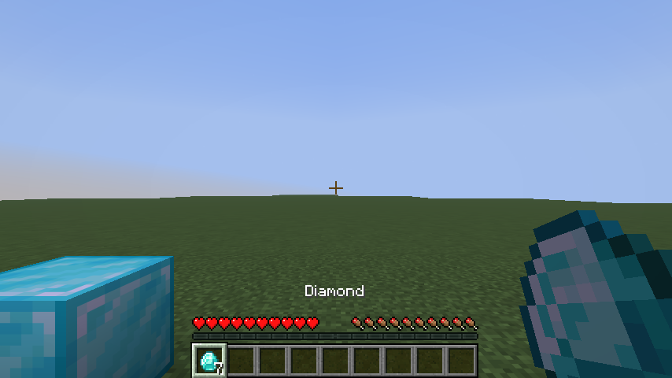

# Prime Backup 1.13.1 适配测试

日期：2026-10-01，基线 Minecraft 26.3 正式版 / Fabric。桥接与专用适配插件 0.2.0，MCDR 2.16.0，Python 3.14.5，Java 25.0.3，Fabric Loader 0.19.5，Fabric API 0.161.0+26.3。

## 原版问题复现

使用官方发布的 `PrimeBackup-v1.13.1.pyz`（源码 tag `v1.13.1`，commit `80f818741de36549d3d69ea5eb3a21ce8e37917e`）。插件正常加载，游戏聊天发出 `!!pb make bridge-test`，但内置服务端拒绝 `save-off`、`save-all flush`、`save-on`，最终等待保存超时。复现测试使用 3 秒保存等待时间，默认配置是 10 分钟。



证据：[未适配日志](assets/prime-backup-baseline.log)。参考原版的 [创建任务](https://github.com/TISUnion/PrimeBackup/blob/v1.13.1/prime_backup/mcdr/task/backup/create_backup_task.py) 和 [恢复任务](https://github.com/TISUnion/PrimeBackup/blob/v1.13.1/prime_backup/mcdr/task/backup/restore_backup_task.py)。

## 适配后的真实单人世界测试

使用原版 Prime Backup 发布文件、真实 MCDR 进程和 Fabric 客户端测试环境，创建独立的平坦测试世界。没有操作用户的已有存档。

1. 在世界放置钻石块，并将快捷栏第一个格子设为 7 个钻石，同时创建文本标记文件。
2. 在游戏聊天执行 `!!pb make bridge-test`，完成 flush 后创建备份 #1，并确认自动保存恢复。
3. 游戏中执行 `!!pb list`、`!!pb show 1` 和 `!!pb export 1 zip`。检查 ZIP 包内的 `level.dat` 和文本标记的实际内容。
4. 暂停游戏后从 MCDR 控制台请求创建备份，任务拒绝执行。
5. 热重载 Prime Backup，MCDR 按依赖关系同时重载适配插件；之后的保护和回档继续生效。
6. 用 MCDR `stop` 仅断开桥接，游戏仍在世界内。随后请求离线回档，实际 Minecraft `session.lock` 阻止恢复。
7. 将钻石块改成金块，钻石改成 3 个金锭，文本标记改为新内容。重新连接桥接，在游戏聊天发出 `!!pb back 1` 并通过 `!!pb confirm` 确认。
8. 游戏保存退出，收到真实世界关闭事件并确认存档锁已释放后，Prime Backup 先创建临时备份，再恢复 #1。
9. 测试程序模拟用户手动重新打开同一存档，实际检查方块为钻石块、背包为 7 个钻石、文本内容为备份原值。重新连接 MCDR，并再次调用 Prime Backup 查询。





证据：[适配日志](assets/prime-backup-adapted.log)。日志不包含桥接令牌。

## 自动检查

Python `python -m pytest -q`：27 项通过，包含真实 MCDR 基础集成、命令确认、断开与世界关闭的区别、存档边界、独立进程文件锁，以及配置脚本保留已有配置。

Java `gradlew test`：6 项网络测试，增加暂停时允许有鉴权的保存退出请求，但仍拒绝跨会话退出请求。

真实客户端执行命令：

```powershell
$env:JAVA_HOME = 'C:\Program Files\Java\jdk-25.0.3'
$env:MCDR_BRIDGE_TEST_PYTHON = (Resolve-Path '.venv/Scripts/python.exe').Path
$env:MCDR_BRIDGE_TEST_ROOT = (Get-Location).Path
$env:MCDR_BRIDGE_TEST_PRIME_BACKUP = (Resolve-Path '.reference/PrimeBackup-v1.13.1.pyz').Path
.\fabric-bridge\gradlew.bat -p fabric-bridge runClientGameTest --console=plain
```

核心桥接游戏测试还验证了 `save-off` 后断开网络，自动保存会恢复；原有聊天、暂停、会话隔离与真实 MCDR 回复测试继续运行。

本记录不代表已验证任意大型整合包、全部 Prime Backup 子命令、定时备份/清理作业、LAN 多人、Linux/macOS、符号链接存档或其他游戏版本。回档后自动重进世界尚未实现。

## 发布包验证与归档

`scripts/build.ps1` 已完成 27 项 Python 测试、实际 Gradle `build`（含 6 项 Java 测试）、MCDR 官方打包及 SHA-256 归档。Mod 位于 `mod-builds/20261001-221207/mcdr-singleplayer-bridge-0.2.0.jar`；最终完整安装包和两个 MCDR 插件位于 `mod-builds/20261001-221412/`。

从最终归档 ZIP 解压到隔离目录，校验哈希和生产文件内容；运行两个附带配置脚本，并使用实际打包后的两个插件与官方 Prime Backup 启动真实 MCDR。离线创建备份、修改文件后回档、回档前临时备份、再次创建备份和正常退出均通过。原游戏世界仅复制到测试目录，验证没有修改源存档。

离线发布包实测日志：[prime-backup-release-smoke.log](assets/prime-backup-release-smoke.log)。
