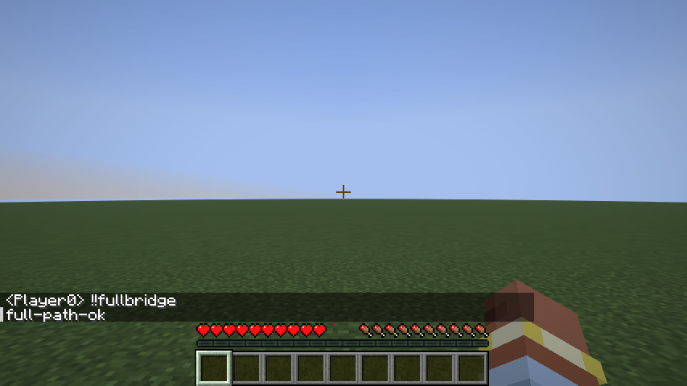

# 26.3 Fabric 首版测试记录

下面记录 0.1.0 首版验证；0.2.0 的新增保存与 Prime Backup 适配验证见 [PrimeBackup测试记录](PrimeBackup测试记录.md)。

测试日期：2026-10-01（Asia/Hong_Kong）。版本：桥接 0.1.0，Minecraft 26.3 正式版，Fabric Loader 0.19.5，Fabric API 0.161.0+26.3，Java 25.0.3，Loom 1.17.21，Gradle 9.6.0，MCDReforged 2.16.0，Python 3.14.5。

## 自动测试

- Python：`python -m pytest -q`，17 项通过。包含协议边界、事件类型、玩家身份、连接握手、中文传输、会话隔离，以及真实 MCDR 的插件加载、启动版本、聊天回复、权限、插件热重载和代理停止。
- Java：`fabric-bridge/gradlew.bat -p fabric-bridge test --console=plain`。5 项真实 socket 测试覆盖令牌拒绝、玩家快照、玩家事件去重、过期/跨会话/暂停命令拒绝、反馈完成一次、关闭会话、非法 UTF-8 与超长消息。
- 单人游戏：`fabric-bridge/gradlew.bat -p fabric-bridge runClientGameTest --console=plain`。已实际启动 Minecraft 26.3 客户端并创建独立的测试世界。

## 已通过的真实游戏验证

1. Mod 正常加载，进入单人世界后提供本机桥接接口。
2. 在线玩家快照和真实游戏版本正确。
3. 从桥接 socket 执行 `list` 并取得成功反馈。
4. 从桥接执行 `tellraw`，客户端收到对应文本。
5. 游戏聊天消息上报，玩家身份与消息内容正确。
6. 无效命令返回失败，旧会话命令被拒绝。
7. 打开暂停菜单时报告暂停并拒绝命令，恢复后继续运行。
8. 保存退出后发出世界停止事件；进入新世界后使用不同会话标识。
9. 真实 MCDR 2.16.0 加载本项目的 packed 插件及另一个测试插件。游戏发送 `!!fullbridge` 后，测试插件通过 MCDR `source.reply` 回复，游戏显示 `full-path-ok`。
10. 退出 MCDR 代理连接后，客户端仍留在当前世界。

完整链路的 MCDR 日志保存在 [mcdr-full-path.log](assets/mcdr-full-path.log)。该日志不包含桥接令牌。

## 验证边界

这是开发环境下的自动单人游戏实测，不是用户现有整合包的人工验收。没有运行所有第三方 MCDR 插件，没有验证备份回档、RCON、自动重开世界、多人 LAN 环境或其他游戏版本、加载器。

安装产物由 `scripts/build.ps1` 使用真实 Gradle `build` 生成，再运行 MCDR 官方 `pack` 打包插件。每次成功构建的产物均存入新的 `mod-builds/YYYYMMDD-HHMMSS` 目录，包含 SHA-256 清单。

发布包检查已通过：校验所有归档文件的大小与 SHA-256；检查生产 JAR 的游戏版本及测试类排除；检查 packed 插件的目录结构；在隔离目录解压安装包，运行附带配置脚本，启动真实 MCDR 并成功加载插件与自定义 handler，随后正常退出。测试脚本保持标准输入打开直到进程退出，避免 MCDR 对管道 EOF 的重复读取影响检查。

本次 Mod 归档：`mod-builds/20261001-205730/mcdr-singleplayer-bridge-0.1.0.jar`。插件及完整安装包归档：`mod-builds/20261001-205732/`。
